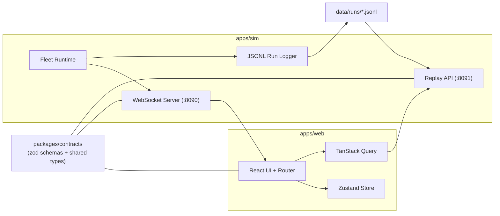

# RoboOps Mission Control

RoboOps Mission Control is an operations and debugging console for autonomous robot fleets.
The MVP combines live fleet monitoring, incident triage, replay from JSONL logs, and incident report export.

## What Problem This Solves

Autonomy and robotics teams need one operator surface to:
- monitor fleet health and mission progress in real time,
- identify incident patterns quickly (stuck, sensor fail, localization dropouts, geofence violations),
- replay historical runs with synchronized timeline, trajectory, and metrics,
- generate structured incident artifacts for engineering handoff.

## Product Scope

- Fleet overview with filtering, search, sorting, and status-focused UX.
- Dual map modes:
  - Delivery rover map (`MapLibre` overlays and geofences).
  - Warehouse AMR floorplan (SVG zones and mission routing context).
- Robot detail page with telemetry charts, sensor health matrix, live logs, and operator actions.
- Incidents queue with filtering and direct jump to replay.
- Replay viewer with scrubber, marker jumps, speed controls, and synchronized metrics.
- Incident report export (`.json` and `.md`) with replay deep links.

## Screenshots and GIF

Capture assets are organized in `docs/media`.
Expected files:
- `docs/media/fleet-overview.png`
- `docs/media/live-map-delivery.png`
- `docs/media/live-map-warehouse.png`
- `docs/media/robot-detail.png`
- `docs/media/incidents.png`
- `docs/media/replay.gif`

## Tech Stack

- Frontend: React, TypeScript, Vite, Tailwind CSS v4, Zustand, TanStack Query, Recharts, MapLibre GL.
- Simulator backend: Node.js, TypeScript, `ws`.
- Contracts: shared runtime schemas and types via `@roboops/contracts` (`zod`).
- Replay source: JSONL run logs in `data/runs`.

## Repository Layout

- `apps/web` - frontend application.
- `apps/sim` - simulator, WebSocket stream server, replay API.
- `packages/contracts` - shared schemas/types used by web and sim.
- `data/runs` - generated JSONL run sessions for replay.
- `docs` - architecture notes and media.

## Local Run

Prerequisites:
- Node.js 20+.
- npm 10+.

### One-Command Start (Recommended)

From repository root:

```bash
npm run dev
```

This starts both:
- simulator + WS + replay API
- frontend on `http://127.0.0.1:5173`

Optional fast start (skip dependency checks):

```bash
npm run dev:skip-install
```

1. Start simulator and replay API:

```bash
cd apps/sim
npm install
npm run dev
```

Default endpoints:
- WebSocket stream: `ws://localhost:8090`
- Replay API: `http://localhost:8091`

2. Start frontend:

```bash
cd apps/web
npm install
npm run dev -- --host 127.0.0.1 --port 5173
```

Open `http://127.0.0.1:5173`.

## Available Commands

`apps/web`:
- `npm run dev`
- `npm run test`
- `npm run lint`
- `npm run build`
- `npm run preview`

`apps/sim`:
- `npm run dev`
- `npm run start`
- `npm run generate`
- `npm run build`

Root:
- `npm run dev`
- `npm run dev:skip-install`
- `npm run install:all`

## Data Schemas (Core)

Telemetry record:

```ts
{
  type: 'telemetry',
  ts: number,
  robotId: string,
  mode?: 'DELIVERY' | 'WAREHOUSE',
  status?: 'IDLE' | 'ON_MISSION' | 'NEED_ASSIST' | 'FAULT' | 'OFFLINE',
  missionId?: string,
  pose: { x: number, y: number, heading: number },
  speed: number,
  battery: number,
  temp: number,
  localizationConfidence: number,
  sensors: { lidar: 'OK' | 'WARN' | 'FAIL', cam: 'OK' | 'WARN' | 'FAIL', gps: 'OK' | 'WARN' | 'FAIL', imu: 'OK' | 'WARN' | 'FAIL' }
}
```

Event and incident records:

```ts
{
  type: 'event',
  ts: number,
  robotId: string,
  missionId?: string,
  level: 'INFO' | 'WARN' | 'ERROR',
  eventType: string,
  message: string,
  meta: Record<string, unknown>
}
```

```ts
{
  type: 'incident',
  ts: number,
  incidentId: string,
  robotId: string,
  missionId?: string,
  incidentType: 'LOCALIZATION_DROPOUT' | 'OBSTACLE_BLOCKED' | 'STUCK' | 'SENSOR_FAIL' | 'GEOFENCE_VIOLATION',
  severity: 'LOW' | 'MEDIUM' | 'HIGH' | 'CRITICAL',
  message: string,
  resolved: boolean,
  meta: Record<string, unknown>
}
```

WebSocket server messages:
- `snapshot`
- `telemetry`
- `event`
- `incident`
- `heartbeat`

Full schema source: `packages/contracts/src/index.ts`.

## Architecture

Detailed document: `docs/architecture.md`.



## Next Steps

- Add smoke Playwright tests for critical user flows.
- Record and attach a 2-minute demo walkthrough.
- Deploy web and simulator with production WS/replay URLs.

## Demo Assets

- Script: `docs/demo-script.md`
- Recording guide: `docs/demo-video-recording.md`
