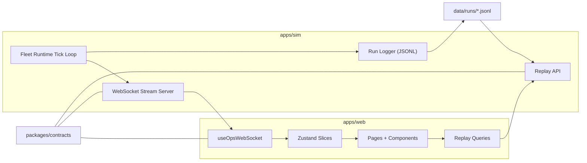
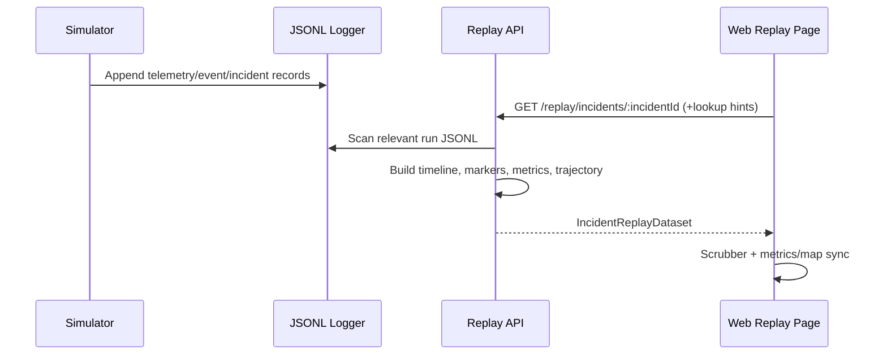

# RoboOps Mission Control - Architecture

## Main Components

- `apps/web`
  - UI shell and pages (`Fleet`, `Live Map`, `Robot Detail`, `Incidents`, `Replay`)
  - State management (`Zustand`)
  - Replay data fetching (`TanStack Query`)
  - WebSocket stream client
- `apps/sim`
  - Fleet runtime and anomaly simulator
  - WebSocket stream server (`ws`)
  - JSONL run logger
  - Replay API server (reads JSONL and serves normalized incident replay datasets)
- `packages/contracts`
  - Shared `zod` schemas and TypeScript types
  - Runtime payload validation on both producer and consumer paths

## Runtime Data Flow

## Streaming Protocol

Server emits ordered messages:
- `snapshot`: full fleet snapshot and summaries.
- `telemetry`: per-robot stream updates.
- `event`: logs and state changes.
- `incident`: incident entities.
- `heartbeat`: server health, mode, and run metadata.

Unified service routes (Render deployment target):
- WebSocket: `/ws`
- Replay API: `/replay/runs`, `/replay/incidents/:incidentId`
- Health: `/health`

Client behavior:
- validates every payload via shared schema,
- stores `lastStreamSeq` and supports resume flow after reconnect,
- batches message application to reduce UI render pressure.

## Replay Pipeline

## Storage and Contracts

- Log storage: append-only JSONL, one run file per simulator session.
- Shared schema authority: `packages/contracts/src/index.ts`.
- Replay API output model:
  - run metadata (`runId`, `mode`, `startedAtTs`, `endedAtTs`)
  - timeline (`INFO/WARN/ERROR` events)
  - markers (`WARN/ERROR`)
  - trajectory points
  - derived metrics over time

## Reliability and Extension Points

Current reliability features:
- reconnect-safe stream resume via `lastStreamSeq`,
- heartbeat visibility in UI,
- deduplication of repeated events/incidents on the client.
